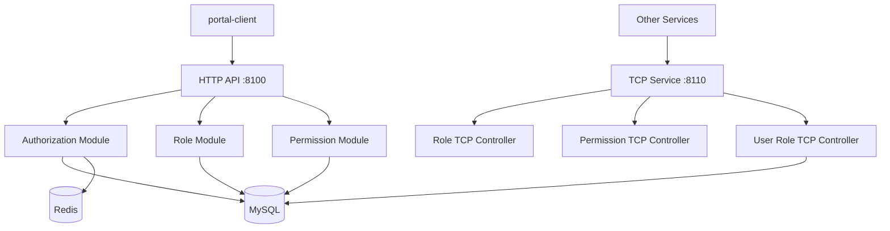

# Authorization Server

> KRGeobuk 생태계의 핵심 권한 관리 서비스

krgeobuk 마이크로서비스 생태계의 중앙 권한 서버로, RBAC(Role-Based Access Control) 기반의 완전한 권한 관리 시스템과 TCP 마이크로서비스 통신을 제공합니다.

## ✨ 주요 기능

### 🔐 권한 관리 시스템
- **RBAC 시스템** - 역할 기반 접근 제어 (Role-Based Access Control)
- **완전한 권한 관리** - 권한(Permission), 역할(Role), 사용자-역할 매핑
- **서비스별 권한 분리** - 각 마이크로서비스의 독립적 권한 체계
- **동적 권한 할당** - 실시간 권한 부여 및 취소

### 🌐 마이크로서비스 아키텍처
- **HTTP REST API** - 관리자 인터페이스용 표준 API (포트 8100)
- **TCP 마이크로서비스** - 서비스 간 고성능 권한 조회 (포트 8110)
- **권한 검증 서비스** - 실시간 사용자 권한 확인
- **배치 처리 지원** - 대량 권한 할당/해제 최적화

### 🛡️ 보안 & 성능
- **중간테이블 최적화** - 고성능 다대다 관계 처리
- **인덱스 기반 빠른 조회** - 복합 인덱스를 통한 성능 최적화
- **Redis 캐싱** - 빈번한 권한 조회 캐싱
- **구조화된 로깅** - Winston 기반 상세 모니터링

## 🛠 기술 스택

### Backend Framework
- **NestJS** - 확장 가능한 Node.js 서버 프레임워크
- **TypeScript** - ES 모듈 지원과 함께 완전한 TypeScript 구현
- **Express** - HTTP 서버 엔진

### Database & Cache
- **MySQL 8** - 관계형 데이터베이스 (포트 3308)
- **Redis** - 인메모리 캐시 및 세션 저장소 (포트 6381)
- **TypeORM** - 객체 관계 매핑 (ORM)

### Integration
- **JWT** - Access Token 기반 인증
- **TCP Microservices** - 고성능 서비스 간 권한 조회
- **@krgeobuk 패키지** - 공유 라이브러리 생태계

## 🚀 빠른 시작

### 환경 요구사항
- Node.js 18+
- Docker & Docker Compose
- MySQL 8.0+
- Redis 7.0+

### 설치 및 실행
```bash
# 1. 의존성 설치
npm install

# 2. 환경 변수 설정
cp envs/.env.example envs/.env.local
# .env.local 파일에서 실제 값으로 수정

# 3. Docker 인프라 시작 (MySQL + Redis)
npm run docker:local:up

# 4. 개발 서버 시작
npm run start:debug
```

서버가 다음 포트에서 실행됩니다:
- **HTTP API**: http://localhost:8100
- **TCP Service**: localhost:8110
- **Swagger Docs**: http://localhost:8100/api/docs

### 주요 환경 변수
```bash
# 서버 설정
NODE_ENV=development
PORT=8100
TCP_PORT=8110
APP_NAME=authz-server

# 클라이언트 URL
AUTH_CLIENT_URL=http://localhost:3000
PORTAL_CLIENT_URL=http://localhost:3200

# MySQL 데이터베이스
MYSQL_HOST=authz-mysql
MYSQL_PORT=3306              # 컨테이너 내부 포트
MYSQL_OPEN_PORT=3308         # 외부 접근 포트
MYSQL_USER=krgeobuk
MYSQL_PASSWORD=your-mysql-password
MYSQL_DATABASE=authz

# Redis 캐시
REDIS_HOST=authz-redis
REDIS_PORT=6379              # 컨테이너 내부 포트
REDIS_OPEN_PORT=6381         # 외부 접근 포트
REDIS_PASSWORD=your-redis-password

# JWT 공개키 (auth-server에서 발급한 토큰 검증용)
JWT_ACCESS_PUBLIC_KEY_PATH=./keys/access-public.key
```

## 🏗️ 아키텍처

### 서비스 구조


### RBAC 도메인 구조
```
권한 관리 도메인:
├── role/                  # 역할 관리
├── permission/            # 권한 관리
├── user-role/            # 사용자-역할 매핑
├── role-permission/      # 역할-권한 매핑
└── service-visible-role/ # 서비스 가시성 역할
```

### 프로젝트 구조
```
src/
├── modules/                # 도메인 모듈
│   ├── authorization/      # 권한 검증 서비스
│   ├── permission/         # 권한 관리
│   ├── role/              # 역할 관리
│   ├── user-role/         # 사용자-역할 매핑
│   ├── role-permission/   # 역할-권한 매핑
│   └── service-visible-role/ # 서비스 가시성
├── common/                # 공통 기능
│   ├── authorization/     # 권한 가드
│   ├── jwt/              # JWT 토큰 검증
│   └── clients/          # TCP 클라이언트
├── config/               # 환경 설정
├── database/             # 데이터베이스 연결
│   ├── mysql/            # TypeORM 설정
│   └── redis/            # Redis 설정
└── main.ts               # 애플리케이션 진입점
```

## 📡 API 문서

### HTTP REST API

#### 권한 관리 엔드포인트
```bash
GET    /api/permissions           # 권한 목록 조회 (검색)
POST   /api/permissions           # 권한 생성
GET    /api/permissions/:id       # 권한 상세 조회
PATCH  /api/permissions/:id       # 권한 수정
DELETE /api/permissions/:id       # 권한 삭제
```

#### 역할 관리 엔드포인트
```bash
GET    /api/roles                 # 역할 목록 조회 (검색)
POST   /api/roles                 # 역할 생성
GET    /api/roles/:id             # 역할 상세 조회
PATCH  /api/roles/:id             # 역할 수정
DELETE /api/roles/:id             # 역할 삭제
```

#### 권한 검증 엔드포인트
```bash
POST   /api/authorization/check   # 사용자 권한 확인
POST   /api/authorization/bulk-check # 다중 권한 확인
```

#### 사용자-역할 관리
```bash
GET    /api/users/:userId/roles            # 사용자 역할 목록
GET    /api/roles/:roleId/users            # 역할 사용자 목록
POST   /api/users/:userId/roles/:roleId    # 사용자 역할 할당
DELETE /api/users/:userId/roles/:roleId    # 사용자 역할 해제
POST   /api/users/:userId/roles/batch      # 사용자 역할 배치 할당
PUT    /api/users/:userId/roles            # 사용자 역할 완전 교체
```

#### 역할-권한 관리
```bash
GET    /api/roles/:roleId/permissions      # 역할 권한 목록
GET    /api/permissions/:permId/roles      # 권한 역할 목록
POST   /api/roles/:roleId/permissions/batch # 역할 권한 배치 할당
PUT    /api/roles/:roleId/permissions      # 역할 권한 완전 교체
```

### TCP 마이크로서비스 API

다른 서비스에서 권한 확인을 위한 고성능 TCP 통신:

#### 권한 조회 패턴
```typescript
// 사용자 권한 확인
const hasPermission = await client.send('authorization.check', {
  userId: 'user-123',
  action: 'user:create',
  serviceId: 'auth-service'
}).toPromise();

// 사용자 역할 조회
const userRoles = await client.send('user-role.findRolesByUser', {
  userId: 'user-123'
}).toPromise();

// 역할 권한 조회
const rolePermissions = await client.send('role-permission.findPermissionsByRole', {
  roleId: 'role-123'
}).toPromise();
```

### 사용 가능한 TCP 패턴
| 패턴 | 설명 | 요청 | 응답 |
|------|------|------|------|
| `authorization.check` | 권한 확인 | `{ userId, action, serviceId }` | `boolean` |
| `user-role.findRolesByUser` | 사용자 역할 조회 | `{ userId }` | `string[]` |
| `role-permission.findPermissionsByRole` | 역할 권한 조회 | `{ roleId }` | `string[]` |
| `role.findByServiceId` | 서비스 역할 조회 | `{ serviceId }` | `Role[]` |
| `permission.findByServiceId` | 서비스 권한 조회 | `{ serviceId }` | `Permission[]` |

## 📦 스크립트

### 개발
```bash
npm run start:debug     # 개발 서버 (nodemon)
npm run build          # TypeScript 빌드
npm run build:watch    # 감시 모드 빌드
```

### 코드 품질
```bash
npm run lint           # ESLint 검사
npm run lint-fix       # ESLint 자동 수정
npm run format         # Prettier 포맷팅
```

### 테스트
```bash
npm run test           # 단위 테스트
npm run test:watch     # 감시 모드 테스트
npm run test:cov       # 커버리지 테스트
```

### Docker 운영
```bash
npm run docker:local:up    # 로컬 환경 시작
npm run docker:dev:up      # 개발 환경 시작
npm run docker:prod:up     # 프로덕션 환경 시작
npm run docker:local:down  # 환경 중지
```

## 🐳 Docker 배포

### 로컬 개발 환경
```bash
# 전체 스택 시작 (MySQL + Redis + App)
npm run docker:local:up

# 개별 서비스 접근
docker-compose logs authz-server  # 애플리케이션 로그
docker-compose logs mysql          # 데이터베이스 로그
```

### 프로덕션 배포
```bash
# 프로덕션 환경으로 배포
npm run docker:prod:up

# 환경별 설정 파일
# - docker-compose.yml (기본)
# - docker-compose.dev.yml (개발)
# - docker-compose.prod.yml (프로덕션)
```

## 🔗 서비스 연동

### 다른 서비스에서 authz-server 사용

```typescript
// auth-server에서 사용 예시
@Injectable()
export class AuthService {
  constructor(
    @Inject('AUTHZ_SERVICE') private authzClient: ClientProxy
  ) {}

  async checkUserPermission(userId: string, action: string, serviceId: string) {
    // authz-server TCP로 권한 확인
    const hasPermission = await this.authzClient
      .send('authorization.check', { userId, action, serviceId })
      .toPromise();
      
    return hasPermission;
  }

  async getUserRoles(userId: string): Promise<string[]> {
    return this.authzClient
      .send('user-role.findRolesByUser', { userId })
      .toPromise();
  }
}
```

### 클라이언트 설정
```typescript
// 다른 서비스의 app.module.ts
ClientsModule.register([
  {
    name: 'AUTHZ_SERVICE',
    transport: Transport.TCP,
    options: {
      host: 'authz-server',  // Docker 네트워크
      port: 8110,
    },
  },
])
```

## 📊 권한 모델

### RBAC 구조
```
사용자 (User) ←→ 역할 (Role) ←→ 권한 (Permission)
     ↑              ↑                  ↑
  auth-server   authz-server      authz-server
```

### 권한 체크 흐름
1. **권한 요청**: 다른 서비스에서 사용자 권한 확인 요청
2. **역할 조회**: user-role 테이블에서 사용자의 역할 목록 조회
3. **권한 조회**: role-permission 테이블에서 역할의 권한 목록 조회
4. **권한 매칭**: 요청된 권한이 사용자 권한 목록에 포함되는지 확인
5. **결과 반환**: boolean 값으로 권한 여부 반환

### 성능 최적화
- **인덱스 최적화**: 복합 인덱스를 통한 빠른 권한 조회
- **배치 처리**: 다중 권한 확인을 위한 배치 API
- **TCP 통신**: HTTP보다 빠른 마이크로서비스 통신
- **Redis 캐싱**: 빈번한 권한 조회 결과 캐싱

## 🤝 기여하기

1. 이 레포지토리를 Fork
2. feature 브랜치 생성 (`git checkout -b feature/amazing-feature`)
3. 변경사항 커밋 (`git commit -m 'Add some amazing feature'`)
4. 브랜치에 Push (`git push origin feature/amazing-feature`)
5. Pull Request 생성

### 개발 가이드라인
- [CLAUDE.md](./CLAUDE.md) 개발 표준 준수
- ESLint + Prettier 코드 스타일 적용
- 단위 테스트 작성 필수
- API 변경 시 Swagger 문서 업데이트

## 📄 라이선스

이 프로젝트는 MIT 라이선스 하에 배포됩니다.

---

**KRGeobuk Authorization Server** - 확장 가능하고 고성능인 권한 관리 서비스

© 2024 KRGeobuk. All rights reserved.